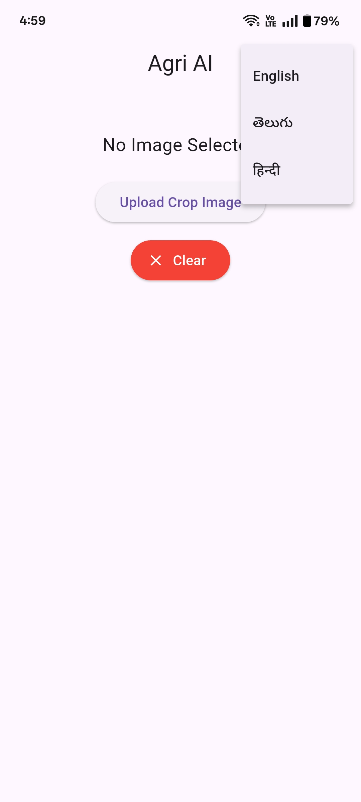

# 🌾 Agri AI App

An AI-powered mobile application built using Flutter that helps farmers and users with smart agriculture solutions such as crop analysis, disease detection, and farming assistance.

---

## 🚀 Features

* 🌱 Crop analysis and recommendations
* 🦠 Plant disease detection using AI
* 📊 Smart farming insights
* 📷 Image-based prediction system
* 🔥 User-friendly mobile interface

---

## 🛠️ Tech Stack

* **Frontend:** Flutter (Dart)
* **Backend:** Python / Firebase
* **Machine Learning:** TensorFlow / Keras
* **Database:** Firebase / Local Storage

---

## 📂 Project Structure

```
agri-ai-app/
│── android/
│── ios/
│── lib/
│── assets/
│── backend/
│── web/
│── windows/
│── linux/
│── macos/
│── pubspec.yaml
│── README.md
```

---

## 📸 App Screenshot

```

```

---

## ⚙️ Installation

1. Clone the repository:

```
git clone https://github.com/Abhigna2904/Agri-AI-App.git
```

2. Navigate to the project folder:

```
cd Agri-AI-App
```

3. Install dependencies:

```
flutter pub get
```

4. Run the app:

```
flutter run
```

---

## 🎯 Future Improvements

* 🌍 Multi-language support
* 📡 Real-time weather integration
* 🤖 Advanced AI recommendations
* ☁️ Cloud-based model deployment

---

## 👨‍💻 Author

* Developed by **Abhigna**

---

## ⭐ Contribute

Contributions are welcome! Feel free to fork this repository and submit pull requests.

---
